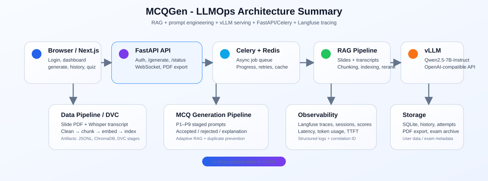

# CS317 — MCQGen: Hệ Thống Sinh Đề Thi MCQ Tự Động với LLMOps

> **Đồ án môn CS317 — Nhóm 3 | ĐH Công nghệ Thông tin, ĐHQG TP.HCM**  
> Hệ thống sinh câu hỏi trắc nghiệm từ slide PDF và transcript bài giảng, kết hợp RAG, prompt engineering và vLLM serving.

[](https://python.org)
[](https://vllm.ai)
[](https://fastapi.tiangolo.com)
[](https://nextjs.org)
[](https://dvc.org)
[](LICENSE)

---

## Mục lục

- [Tổng quan](#-tổng-quan)
- [Practical Extension for Lab](#-practical-extension-for-lab)
- [Kết quả nổi bật](#-kết-quả-nổi-bật)
- [Kiến trúc hệ thống](#-kiến-trúc-hệ-thống)
- [Tech Stack](#️-tech-stack)
- [Yêu cầu hệ thống](#-yêu-cầu-hệ-thống)
- [Cài đặt](#-cài-đặt)
- [Khởi động & dừng hệ thống](#-khởi-động--dừng-hệ-thống)
- [Hướng dẫn sử dụng](docs/huong-dan-su-dung.md)
- [Troubleshooting](#-troubleshooting)
- [Release History](#-release-history)
- [Nhóm thực hiện](#-nhóm-thực-hiện)

---

## 📌 Tổng quan

MCQGen là hệ thống end-to-end tự động sinh câu hỏi trắc nghiệm (Multiple Choice Questions) cho môn **CS116 — Lập trình Python cho Máy học**.  
Hệ thống nhận đầu vào là slide PDF và transcript bài giảng (Whisper ASR), sau đó đi qua pipeline RAG + prompt engineering để sinh câu hỏi chất lượng cao.

Điểm LLMOps chính của project:

- DVC quản lý pipeline dữ liệu.
- vLLM host model local.
- FastAPI + Celery + Redis xử lý request bất đồng bộ.

---

## 🧪 Practical Extension for Lab

So với project ban đầu, phiên bản dùng cho bài thực hành nhấn mạnh các thành phần vận hành **LLMOps** thay vì chỉ dừng ở việc gọi LLM để sinh câu hỏi. Các phần mở rộng chính gồm:

- **Data pipeline có thể tái lập**: DVC xử lý slide/transcript, sinh chunk, build vector index và benchmark retrieval.
- **RAG optimization**: hỗ trợ adaptive retrieval với naive retrieval, HyDE, sentence-window collection và cross-encoder rerank.
- **Prompt optimization**: quản lý prompt theo version, bổ sung style bank từ đề CS116 thật, guardrail cho opening style và misconception-guided distractor.
- **Serving/runtime optimization**: phục vụ Qwen2.5-7B-Instruct bằng vLLM local, tận dụng batching, prefix caching, async pipeline và dynamic concurrency.
- **System optimization**: FastAPI + Celery + Redis cho xử lý bất đồng bộ, Redis cache cho request trùng và dedup câu hỏi theo lịch sử.

**Lưu ý quan trọng:**

- Nhóm **không fine-tune / quantize / optimize trọng số** của Qwen2.5-7B-Instruct.
- Phần "model optimization" trong project này được hiểu theo đúng bối cảnh **LLMOps**: tối ưu retrieval, prompt, runtime serving, cache và concurrency.
- Các kết quả đo phụ thuộc GPU, version vLLM và workload. Những mục chưa đo đầy đủ được ghi rõ trong báo cáo, đặc biệt là so sánh prompt v1/v2 và prefix-cache ablation.

### Báo cáo liên quan tới bài thực hành 1

Toàn bộ báo cáo và hình minh họa của bài thực hành 1 được gom trong:

- `reports/thuc-hanh-1/`
- `figure/thuc-hanh-1/`
- `figure/chung/` cho tài sản dùng chung giữa các bài

Các báo cáo hiện có:

- [Báo cáo Data Pipeline](reports/thuc-hanh-1/data_pipeline_report.md): mô tả xử lý slide/transcript, chunking, embedding, ChromaDB index và metric cần ghi nhận cho pipeline dữ liệu.
- [Báo cáo Data Validation](reports/thuc-hanh-1/data_validation_report.md): kiểm tra dữ liệu đầu vào và output processed; run hiện tại **PASS có cảnh báo**, 0 error, 2 warning.
- [Báo cáo Evaluation](reports/thuc-hanh-1/eval_results.md): tổng hợp run sinh đề `exam_01`, acceptance rate, phân bố accepted MCQ, RAG strategy và duplicate rate.
- [Báo cáo API Demo & Testing](reports/thuc-hanh-1/api_testing_report.md): bộ test `pytest` (17 passed), kiểm tra `/health`, build Next.js và CI — kèm ảnh `figure/thuc-hanh-1/api.jpg`.
- [Báo cáo Triển khai Docker](reports/thuc-hanh-1/docker_deployment_report.md): mô tả 2 chế độ chạy hệ thống và các lưu ý khi triển khai trên lab.
- [Báo cáo Monitoring & Evaluation với Langfuse](reports/thuc-hanh-1/langfuse_monitoring_evaluation_report.md): khung báo cáo cho tracing/session/user/latency/score; sẽ được hoàn thiện sau.
- [Báo cáo Optimization Strategy trực quan](reports/thuc-hanh-1/optimization_summary.md): chuyển phần Optimization Strategy ra report riêng, dùng dashboard hình ảnh để giải thích RAG, prompt/Langfuse trace, vLLM serving, async pipeline, quality gate, cache và các mục cần nói thận trọng.

---

## 🏆 Kết quả nổi bật

| Hạng mục                 | Kết quả / ghi nhận hiện tại                                                                                                                                |
| ------------------------ | ---------------------------------------------------------------------------------------------------------------------------------------------------------- |
| Data validation          | **PASS có cảnh báo**: 0 error, 2 warning; 79 transcript JSON, 11 slide PDF; 780 transcript chunks và 993 concept chunks.                                   |
| Evaluation run `exam_01` | 18 câu được yêu cầu, 8 câu accepted, 10 câu rejected/failed → **acceptance rate 44.4%**.                                                                   |
| Duplicate trong accepted | 0 câu trùng theo stem trong 8 câu accepted → dedup theo lịch sử hoạt động tốt ở run này.                                                                   |
| Adaptive RAG             | Benchmark cho thấy adaptive retrieval không kém naive trên 4 topic thử nghiệm, trung bình Δ ≈ **+0.034**; HyDE chỉ được kích hoạt khi naive retrieval yếu. |
| vLLM serving             | Throughput tăng khoảng **3.85×** từ concurrency 1 → 4, trong khi latency P50 gần như giữ quanh ~5.7s.                                                      |
| Async pipeline           | Pipeline async nhanh hơn sequential khoảng **2.08×** ở phần generation-only trong thử nghiệm nhỏ.                                                          |
| Observability            | Langfuse ghi nhận input/output từng prompt stage, latency, token usage, accepted/failed counts, acceptance rate và `reject_stage.<stage>`.                 |

---

## 🏗️ Kiến trúc hệ thống



Tóm tắt:

- Next.js: login, dashboard, generate, history, quiz.
- FastAPI: auth, generate, status, results, PDF export.
- Celery + Redis: async queue, progress tracking, cache và load tracking.
- RAG pipeline: slide PDF + transcript → clean/chunk/index → ChromaDB → adaptive retrieval/rerank.
- vLLM: host Qwen2.5-7B-Instruct local qua OpenAI-compatible API.
- Langfuse: trace session, user, prompt stage, input/output, latency, token usage, score và reject stage.

---

## 🛠️ Tech Stack

| Layer              | Công nghệ                             | Phiên bản |
| ------------------ | ------------------------------------- | --------- |
| Frontend           | Next.js + TypeScript + Tailwind CSS   | 16.x      |
| UI Components      | shadcn/ui                             | latest    |
| State Management   | Zustand                               | 5.0.12    |
| Backend API        | FastAPI                               | 0.136     |
| Authentication     | JWT (python-jose)                     | 3.3.0     |
| Task Queue         | Celery + Redis                        | 5.x       |
| LLM Serving        | vLLM                                  | 0.8.5     |
| LLM Model          | Qwen2.5-7B-Instruct                   | —         |
| RAG Strategy       | HyDE + Sentence-Window + CrossEncoder | custom    |
| Embedding Model    | BAAI/bge-m3                           | —         |
| Vector Database    | ChromaDB                              | 1.5.x     |
| Data Versioning    | DVC                                   | —         |
| LLM Observability  | Langfuse (self-hosted)                | —         |
| Relational DB      | SQLite (sqlmodel)                     | —         |
| Structured Logging | structlog (JSON)                      | 24.x      |
| PDF Export         | ReportLab                             | —         |
| CI/CD              | GitHub Actions                        | —         |
| Containerization   | Docker + Docker Compose v2            | —         |

---

## 🖥️ Yêu cầu hệ thống

| Thành phần  | Yêu cầu                                              |
| ----------- | ---------------------------------------------------- |
| GPU         | RTX 2080 Ti 11GB VRAM hoặc tương đương (≥ 10GB VRAM) |
| RAM         | ≥ 32GB                                               |
| Disk        | ≥ 100GB                                              |
| CUDA Driver | ≥ 12.2 (kiểm tra: `nvidia-smi`)                      |
| OS          | Ubuntu 20.04+                                        |
| Python      | 3.10 (khuyến nghị qua Conda)                         |
| Node.js     | 20.x                                                 |
| Docker      | ≥ 27.x + Docker Compose v2                           |

---

## 🚀 Cài đặt

### Bước 1 — Clone repository

```bash
git clone https://github.com/PTX-Tien/cs317-mcqgen-llmops.git
cd cs317-mcqgen-llmops
```

### Bước 2 — Tạo Conda environment

```bash
conda create -n mcqgen_v2 python=3.10 -y
conda activate mcqgen_v2

# Cài Node.js 20 cho Next.js webapp
conda install -c conda-forge nodejs=20 -y
```

### Bước 3 — Cấu hình biến môi trường

Xem file mẫu tại [`.env.example`](.env.example).  
Người dùng chỉ cần copy file này thành `.env` rồi chỉnh theo máy của mình.
Các file local như `.env.local` và `webapp/.env.local` không cần commit lên Git.

### Bước 4 — Cài Python dependencies

```bash
pip install -r requirements_api.txt
```

### Bước 5 — Download model Qwen2.5-7B-Instruct (~15GB)

```bash
export HF_HOME=/path/to/storage/.cache/huggingface
mkdir -p models

python -c "
from huggingface_hub import snapshot_download
snapshot_download(
    repo_id='Qwen/Qwen2.5-7B-Instruct',
    local_dir='models/Qwen2.5-7B-Instruct',
    ignore_patterns=['*.msgpack', '*.h5']
)
print('Done!')
"
```

### Bước 6 — Chuẩn bị dữ liệu đầu vào

Tải bộ dữ liệu gốc của nhóm tại: **[Google Drive dữ liệu đầu vào](https://drive.google.com/file/d/1mF3OKMXRIcLsFBe4KZZvoSbcKkD9buBl/view?usp=sharing)**

Sau khi tải về, đặt file vào đúng cấu trúc:

```text
input/
├── slide/                    # PDF slides CS116 (11 bài)
│   ├── CS116-Bai02-Popular Libs.pdf
│   ├── CS116-Bai03-Pipeline & EDA.pdf
│   └── ...
├── transcribe_data/          # Whisper ASR JSON
│   ├── 1.1.json
│   └── ...
└── videos1.txt               # YouTube URL mapping
```

### Bước 7 — Build vector index (chạy 1 lần)

```bash
conda activate mcqgen_v2
dvc repro
```

Hoặc chạy từng bước:

```bash
python -m src.mcqgen.chunk_transcripts
python -m src.mcqgen.indexing
python src/gen/sentence_window_indexing.py
```

### Bước 8 — Cài đặt Next.js frontend

Chỉ cần bước này nếu bạn muốn build/run frontend riêng, không dùng `scripts/start_system.sh`.

```bash
cd webapp
npm install
npm run build
cd ..
```

---

## ▶️ Khởi động & dừng hệ thống

### Khởi động

```bash
conda activate mcqgen_v2
bash scripts/start_system.sh
```

Sau khi hệ thống lên, các URL chính:

| Service  | URL                          |
| -------- | ---------------------------- |
| Web UI   | `http://SERVER_IP:8081`      |
| API Docs | `http://SERVER_IP:8080/docs` |
| Langfuse | `http://SERVER_IP:8083`      |

### Dừng hệ thống

```bash
bash scripts/stop_system.sh
```

---

## 📖 Hướng dẫn sử dụng

Chi tiết được tách sang file riêng:

- [docs/huong-dan-su-dung.md](docs/huong-dan-su-dung.md)

---

## ❓ Troubleshooting

**vLLM không start được**

```bash
nvidia-smi
tail -50 logs/vllm.log
```

**FastAPI trả về 401 Unauthorized**

```bash
curl -s -X POST http://localhost:8080/auth/login \
  -d "username=giaovien&password=gv2026" | python3 -m json.tool
```

**ChromaDB lỗi "disk I/O error"**

```bash
rm -rf data/indexes/ data/processed/
dvc repro
```

**Next.js không kết nối được API**

```bash
bash scripts/start_system.sh --no-vllm --no-langfuse
curl http://SERVER_IP:8081/api/health
```

**Redis không bind được port 6379**

```bash
tail -50 logs/redis.log
REDIS_PORT=6380 bash scripts/start_system.sh --no-vllm --no-langfuse
```

Nếu log có `Could not create server TCP listening socket`, hãy kiểm tra port đang bị chiếm hoặc bị giới hạn bởi môi trường chạy. Script sẽ dừng sau `REDIS_WAIT_SECONDS` thay vì chờ vô hạn.

---

## 🔖 Release History

| Tag           | Nội dung                                                                                      |
| ------------- | --------------------------------------------------------------------------------------------- |
| `data-v1.0`   | DVC tracking — slides, transcripts, index                                                     |
| `prompt-v1.0` | Prompt versioning v1 (P1–P8)                                                                  |
| `v1.1`        | Full DVC pipeline + Adaptive RAG + FastAPI + Celery                                           |
| `v1.8`        | Queue position display + `/queue/status` endpoint                                             |
| `v1.9`        | Langfuse tracing                                                                              |
| `v2.0`        | JWT auth + Rate limiting + SQLite + structlog                                                 |
| `v2.1`        | Next.js 16 UI (Login, Dashboard, Generate, History, Quiz, Admin)                              |
| `v2.2`        | README cập nhật báo cáo validation/evaluation/optimization + minh họa Langfuse prompt tracing |

---

## 👥 Nhóm thực hiện

Đồ án môn **CS317 — Hệ Thống Sinh Đề Thi Tham Khảo Cho Sinh Viên**, Nhóm 3  
Trường Đại học Công nghệ Thông tin, ĐHQG TP.HCM
