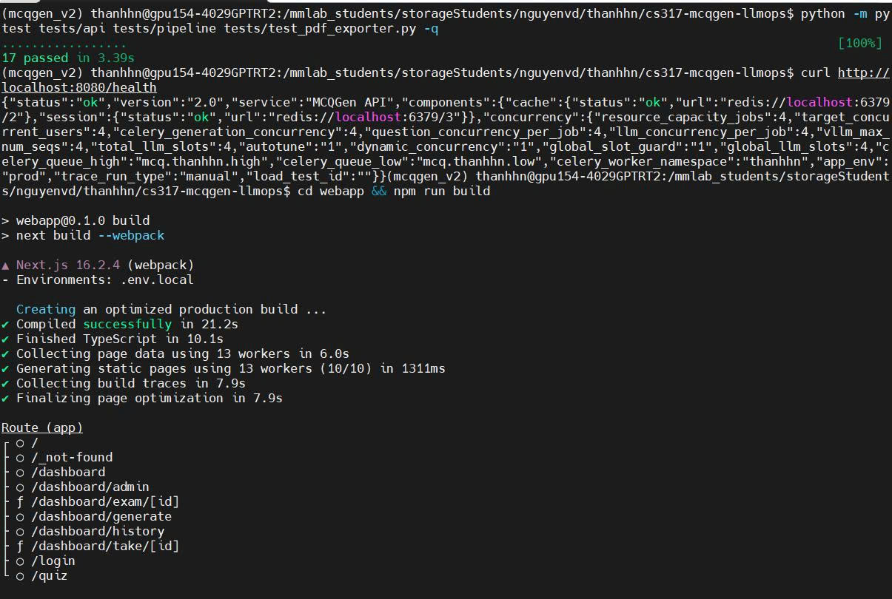

# Báo cáo API Demo & Testing

## 1. Mục tiêu

Báo cáo này trình bày phần kiểm thử (testing) và demo API của hệ thống MCQGen phục vụ bài thực hành
LLMOps: bộ test tự động bằng `pytest`, kiểm tra sức khỏe API qua `/health`, và build giao diện
Next.js. Đây là bằng chứng cho thấy tầng phục vụ (FastAPI + Celery + Redis) và frontend hoạt động ổn định.

## 2. Phạm vi test

Bộ test đặt trong thư mục `tests/`, chia 2 nhóm:

| Test | Kiểm tra điều gì |
| --- | --- |
| `tests/api/test_health.py` | `GET /health` trả 200, `status` ∈ {ok, degraded}, `service = MCQGen API`, `version = 2.0` |
| `tests/api/test_auth.py` | Đăng nhập thiếu field → 422; sai user → 401; admin login thành công; `/auth/me` cần token |
| `tests/api/test_generate_schema.py` | `/generate` không token → 401; body sai schema → 422; `retrieval_mode` sai → 422 |
| `tests/pipeline/test_chunk_schema.py` | `transcript_chunks_with_timestamps.jsonl`: JSON hợp lệ, đủ field bắt buộc, không trùng `chunk_id`, tỷ lệ có timestamp/youtube |
| `tests/pipeline/test_concept_chunks_schema.py` | `concept_chunks.jsonl`: đủ field `chunk_id/chapter_id/source_type/text`, text không rỗng, `source_type` hợp lệ |
| `tests/test_pdf_exporter.py` | `export_exam_pdf()` trả về bytes PDF hợp lệ (bắt đầu bằng `%PDF-`) |

CI tương ứng: `.github/workflows/ci.yml` (chạy `pytest`, `validate_data_pipeline.py`, và build webapp).

## 3. Kết quả chạy

Toàn bộ test chạy thật (hệ thống API + Redis đang chạy nền nên các test API không bị skip):

```text
$ python -m pytest tests/api tests/pipeline tests/test_pdf_exporter.py -q
.................                                                   [100%]
17 passed in 3.39s
```

Ảnh chụp đầy đủ (test + health check + webapp build):



## 4. Health check API

`GET http://localhost:8080/health` trả về trạng thái tổng thể và cấu hình concurrency thực tế:

| Trường | Giá trị | Ý nghĩa |
| --- | --- | --- |
| `status` | `ok` | API + các thành phần nền đều khỏe |
| `version` / `service` | `2.0` / `MCQGen API` | Định danh service |
| `components.cache` | `ok` (`redis://localhost:6379/2`) | Redis cache hoạt động |
| `components.session` | `ok` (`redis://localhost:6379/3`) | Redis session hoạt động |
| `resource_capacity_jobs` | 4 | Số job song song tối đa |
| `vllm_max_num_seqs` / `total_llm_slots` | 4 / 4 | Slot vLLM cấu hình |
| `question_concurrency_per_job` / `llm_concurrency_per_job` | 4 / 4 | Concurrency mỗi job |
| `dynamic_concurrency` / `global_slot_guard` / `autotune` | bật (1) | Cơ chế điều phối tải động |
| `celery_queue_high` / `celery_queue_low` | `mcq.thanhhn.high` / `mcq.thanhhn.low` | Hàng đợi Celery theo namespace |
| `app_env` / `trace_run_type` | `prod` / `manual` | Môi trường + kiểu trace Langfuse |

Trạng thái `ok` ở cả `cache` và `session` xác nhận Redis và tầng async sẵn sàng phục vụ request.

## 5. Build frontend (Next.js)

`cd webapp && npm run build` thành công với Next.js 16.2.4 (webpack):

- Compiled successfully (~21.2s), TypeScript pass (~10.1s).
- Sinh tĩnh 10/10 trang, thu thập build traces và tối ưu hoàn tất.
- Các route chính: `/`, `/login`, `/dashboard`, `/dashboard/generate`, `/dashboard/history`,
  `/dashboard/admin`, `/dashboard/exam/[id]`, `/dashboard/take/[id]`, `/quiz`.

Việc build sạch chứng tỏ frontend khớp với API và sẵn sàng chạy (`npm run dev` ở port 8081).

## 6. Cách tái chạy

```bash
cd /mmlab_students/storageStudents/nguyenvd/thanhhn/cs317-mcqgen-llmops

# (tùy chọn) chạy API không cần GPU để test API chạy thật:
bash scripts/start_system.sh --no-vllm --no-langfuse
curl http://localhost:8080/health

# chạy test
python -m pytest tests/api tests/pipeline tests/test_pdf_exporter.py -q

# build webapp
cd webapp && npm run build
```

## 7. Ghi chú

- Test API dùng FastAPI `TestClient`. Khi môi trường thiếu service nền (Redis/Celery), các test API
  **tự skip** thay vì fail; test schema pipeline và PDF luôn chạy. Trong lần chạy này hệ thống đang
  bật nên đủ **17 test pass**.
- Test `/generate` đăng nhập bằng tài khoản admin mặc định (`ADMIN_USERNAME` / `ADMIN_PASSWORD`).
- Repo còn các script kiểm thử cũ không theo pytest-style (`tests/test_retrieval.py`,
  `tests/test_async_batch.py`, `tests/test_mcq_single.py`) cần vLLM; chạy riêng khi cần.
