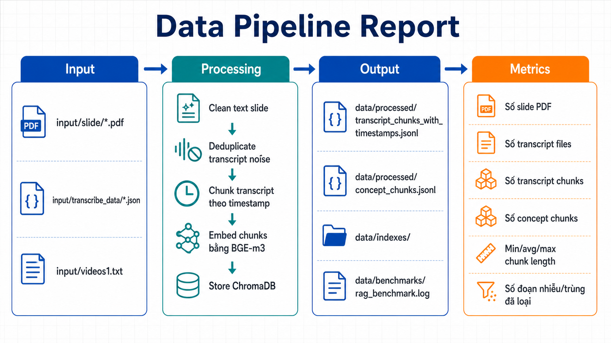

# Báo cáo Data Pipeline

## 1. Mục tiêu

Báo cáo này mô tả pipeline dữ liệu được sử dụng trong hệ thống MCQGen để biến dữ liệu bài giảng thô thành kho tri thức có thể truy hồi cho quá trình sinh câu hỏi trắc nghiệm.

Trong phạm vi bài thực hành MLOps/LLMOps, pipeline dữ liệu không chỉ đóng vai trò tiền xử lý, mà còn là thành phần quan trọng giúp hệ thống có khả năng:

- tái tạo dữ liệu đầu vào bằng DVC;
- chuẩn hóa slide và transcript thành các đơn vị tri thức nhỏ;
- xây dựng vector index phục vụ RAG;
- lưu metadata truy vết nguồn gốc để giải thích câu hỏi được sinh ra;
- đánh giá chất lượng retrieval trước khi đưa vào pipeline sinh đề.



## 2. Phạm vi dữ liệu

Pipeline hiện xử lý dữ liệu cho môn **CS116 - Lập trình Python cho Máy học**. Dữ liệu đầu vào gồm hai nhóm chính:

| Nhóm dữ liệu | Đường dẫn | Vai trò |
| ------------ | --------- | ------- |
| Slide bài giảng | `input/slide/*.pdf` | Cung cấp kiến thức chính thức theo từng chương, từng trang slide |
| Transcript video | `input/transcribe_data/*.json` | Cung cấp diễn giải tự nhiên từ bài giảng, có timestamp theo video |
| Mapping video | `input/videos1.txt` | Liên kết transcript với YouTube URL, chương và metadata slide liên quan |

Các nguồn này được xử lý thành chunk có metadata đầy đủ như `chapter_id`, `chapter_title`, `source_type`, `source_file`, `page_number`, `timestamp_start`, `timestamp_end` và `youtube_url`. Nhờ đó, hệ thống có thể truy hồi đúng ngữ cảnh và trích dẫn lại nguồn khi sinh câu hỏi.

## 3. Pipeline DVC

Pipeline được quản lý bằng `dvc.yaml` với ba stage chính:

```text
transcript_chunking -> indexing -> benchmark_rag
```

### 3.1. `transcript_chunking`

Stage này đọc transcript JSON được trích xuất từ video bài giảng và chuyển thành các transcript chunk có timestamp.

**Command:**

```bash
python -m src.mcqgen.chunk_transcripts
```

**Input chính:**

- `input/transcribe_data/`
- `input/videos1.txt`
- `src/mcqgen/chunk_transcripts.py`
- `src/mcqgen/common.py`

**Xử lý chính:**

- Parse `videos1.txt` để ánh xạ video theo chương và sub-index.
- Đọc các file transcript JSON có word-level timestamp.
- Gom các word-level segment thành đoạn văn bản có ngữ cảnh.
- Loại bỏ nhiễu lặp do ASR hoặc quá trình nối transcript.
- Chunk transcript theo cấu hình hiện tại:
  - target: khoảng 200 từ;
  - minimum: 80 từ;
  - overlap: 30 từ;
  - ưu tiên cắt tại ranh giới câu.
- Gắn metadata cho từng chunk:
  - `chunk_id`;
  - `course_id`;
  - `chapter_id`;
  - `chapter_title`;
  - `source_file`;
  - `timestamp_start`;
  - `timestamp_end`;
  - `youtube_url`;
  - `youtube_timestamp_start`;
  - `youtube_timestamp_end`;
  - `topics`.

**Output:**

- `data/processed/transcript_chunks_with_timestamps.jsonl`

Output này là nguồn transcript đã chuẩn hóa, có thể dùng trực tiếp cho indexing hoặc kiểm tra lại chất lượng dữ liệu.

### 3.2. `indexing`

Stage này kết hợp slide PDF và transcript chunk để tạo kho tri thức dạng concept chunks, sau đó embedding và lưu vào ChromaDB.

**Command:**

```bash
python -m src.mcqgen.indexing
```

**Input chính:**

- `input/slide/`
- `data/processed/transcript_chunks_with_timestamps.jsonl`
- `src/mcqgen/indexing.py`
- `src/mcqgen/common.py`

**Xử lý slide:**

- Đọc từng file PDF theo mapping chương trong `SLIDE_NAME_MAP`.
- Trích xuất text bằng PyMuPDF.
- Làm sạch nội dung slide:
  - loại bỏ footer cố định;
  - loại bỏ tên trường, tên giảng viên nếu xuất hiện lặp;
  - loại bỏ tag hình ảnh do parser sinh ra;
  - loại bỏ markdown image rác;
  - loại bỏ số trang bị tách thành dòng riêng.
- Tạo slide chunk theo từng trang, giữ metadata:
  - `chapter_id`;
  - `chapter_title`;
  - `page_number`;
  - `section_title`;
  - `source_type = slide_pdf`;
  - `source_file`.

**Xử lý transcript:**

- Load transcript chunk đã tạo ở stage trước.
- Giữ lại timestamp, YouTube URL và metadata chương.
- Gộp transcript chunk với slide chunk thành một tập concept chunks thống nhất.

**Embedding và lưu trữ:**

- Dùng model embedding `BAAI/bge-m3`.
- Encode text chunk thành vector embedding.
- Lưu vào ChromaDB tại `data/indexes/`.
- Collection chính: `concept_chunks`.
- Metadata trong ChromaDB được giữ để hỗ trợ filter theo chapter, source type, slide page và timestamp.

**Output:**

- `data/processed/concept_chunks.jsonl`
- `data/indexes/`

### 3.3. `benchmark_rag`

Stage này chạy benchmark retrieval để đánh giá khả năng truy hồi trước khi hệ thống dùng index cho sinh câu hỏi.

**Command:**

```bash
mkdir -p data/benchmarks && python -m src.mcqgen.advanced_retrieval adaptive > data/benchmarks/rag_benchmark.log 2>&1
```

**Input chính:**

- `src/mcqgen/advanced_retrieval.py`
- `data/indexes/`

**Output:**

- `data/benchmarks/rag_benchmark.log`

File log này dùng để kiểm tra retrieval pipeline, bao gồm khả năng lấy đúng chunk theo chương, topic và chiến lược adaptive retrieval.

## 4. Sentence-window index bổ sung

Ngoài pipeline DVC chính, hệ thống còn có script xây dựng sentence-window index:

```bash
python src/gen/sentence_window_indexing.py
```

Mục tiêu của bước này là cải thiện chất lượng retrieval bằng cách:

- tách concept chunk thành các sentence nhỏ hơn;
- embedding sentence ngắn để tăng độ chính xác khi tìm kiếm;
- lưu `window_text` gồm các câu xung quanh để vẫn giữ đủ ngữ cảnh khi sinh câu hỏi;
- lưu collection riêng `concept_chunks_sw` trong ChromaDB.

Cách tiếp cận này giúp cân bằng giữa hai yêu cầu:

- retrieval cần đoạn text ngắn và tập trung;
- generation cần ngữ cảnh đủ rộng để câu hỏi không bị hời hợt hoặc sai nghĩa.

## 5. Output dữ liệu

| Output | Mô tả | Vai trò trong hệ thống |
| ------ | ----- | ---------------------- |
| `data/processed/transcript_chunks_with_timestamps.jsonl` | Transcript đã chunk, có timestamp và YouTube URL | Truy hồi ngữ cảnh từ video bài giảng |
| `data/processed/concept_chunks.jsonl` | Tập chunk hợp nhất từ slide và transcript | Nguồn dữ liệu chính để embedding và kiểm tra |
| `data/processed/concept_chunks_sw.jsonl` | Sentence-window chunks, nếu chạy script bổ sung | Tăng độ chính xác retrieval theo câu |
| `data/indexes/` | ChromaDB persistent index | Vector database dùng trong RAG |
| `data/benchmarks/rag_benchmark.log` | Log benchmark retrieval | Đánh giá chất lượng truy hồi |

## 6. Metrics cần ghi nhận

Các metric dưới đây nên được cập nhật sau mỗi lần chạy pipeline chính thức để phục vụ báo cáo thực hành.

| Metric | Ý nghĩa | Cách lấy gợi ý |
| ------ | ------- | -------------- |
| Số slide PDF | Quy mô nguồn slide đầu vào | Đếm file trong `input/slide/` |
| Số transcript files | Quy mô nguồn transcript đầu vào | Đếm file trong `input/transcribe_data/` |
| Số transcript chunks | Số đơn vị transcript sau xử lý | Đếm dòng JSONL trong `transcript_chunks_with_timestamps.jsonl` |
| Số concept chunks | Tổng số chunk slide + transcript | Đếm dòng JSONL trong `concept_chunks.jsonl` |
| Số sentence-window chunks | Số chunk sau khi mở rộng sentence-window | Đếm dòng JSONL trong `concept_chunks_sw.jsonl` |
| Min/avg/max chunk length | Độ dài chunk sau chuẩn hóa | Tính theo số từ hoặc số ký tự của field `text` |
| Số đoạn nhiễu/trùng đã loại | Hiệu quả bước cleaning/dedup | Ghi nhận từ log hoặc script thống kê bổ sung |
| Số vector trong ChromaDB | Quy mô vector index | Đếm số item trong collection `concept_chunks` và `concept_chunks_sw` |
| Thời gian chạy pipeline | Chi phí xử lý dữ liệu | Đo thời gian `dvc repro` |

## 7. Bảng số liệu hiện tại

> Cần cập nhật bằng số liệu thật sau khi chạy lại pipeline trên máy của nhóm.

| Metric | Giá trị |
| ------ | ------- |
| Số slide PDF | 11 |
| Số transcript files | 79 JSON files (78 transcript hữu ích + 1 file summary) |
| Số transcript chunks | 924 |
| Số concept chunks | 1220 |
| Số sentence-window chunks | 4756 |
| Min chunk length | 5 từ |
| Avg chunk length | 153.61 từ |
| Max chunk length | 264 từ |
| Số đoạn nhiễu/trùng đã loại | 0 chunk có `text_clean` khác `text` trong output hiện tại |
| Thời gian chạy `dvc repro` | DVC wrapper lỗi DB; stage-by-stage tương đương 15m35s (transcript_chunking 4.54s + indexing 483.13s + sentence-window 447.57s) |

> Ghi chú: lệnh `dvc repro` hiện tại trên máy nhóm báo lỗi `unable to open database file`, nên số thời gian ở trên được đo bằng cách chạy từng stage tương đương để vẫn ghi nhận được số liệu thực tế của pipeline dữ liệu.

## 8. Cách tái tạo pipeline

Để chạy lại toàn bộ pipeline dữ liệu:

```bash
conda activate mcqgen_v2
dvc repro
```

Để kiểm tra trạng thái dữ liệu:

```bash
dvc status
dvc dag
```

Để chạy lại từng bước thủ công:

```bash
python -m src.mcqgen.chunk_transcripts
python -m src.mcqgen.indexing
python src/gen/sentence_window_indexing.py
python -m src.mcqgen.advanced_retrieval adaptive
```

## 9. Vai trò của data pipeline trong hệ thống RAG

Pipeline dữ liệu là nền tảng cho toàn bộ hệ thống sinh đề. Nếu chunk bị nhiễu, sai chương hoặc thiếu metadata, pipeline sinh câu hỏi có thể gặp các lỗi như:

- câu hỏi không đúng chương/topic người dùng chọn;
- đáp án thiếu căn cứ từ tài liệu;
- câu hỏi bị lặp lại giữa các lần sinh;
- retrieval trả về đoạn ngữ cảnh quá ngắn hoặc không liên quan;
- Langfuse trace khó phân tích vì thiếu metadata nguồn.

Vì vậy, pipeline dữ liệu cần được xem là một thành phần LLMOps quan trọng, không chỉ là bước chuẩn bị dữ liệu ban đầu. Trong báo cáo thực hành, nhóm nên trình bày rõ dữ liệu được xử lý như thế nào, output được version bằng DVC ra sao và chất lượng retrieval được kiểm tra trước khi đưa vào generation như thế nào.
