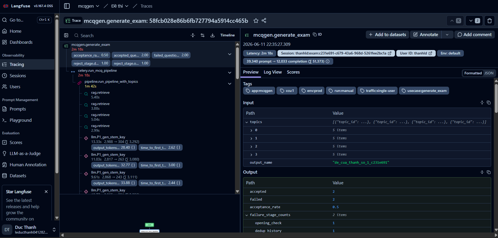
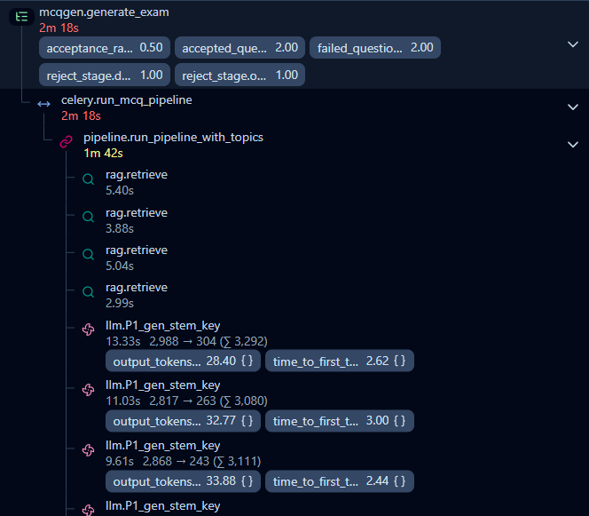
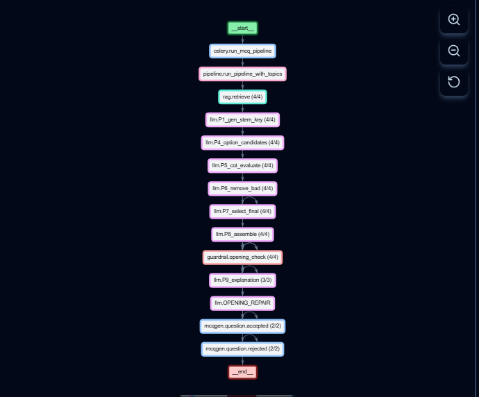
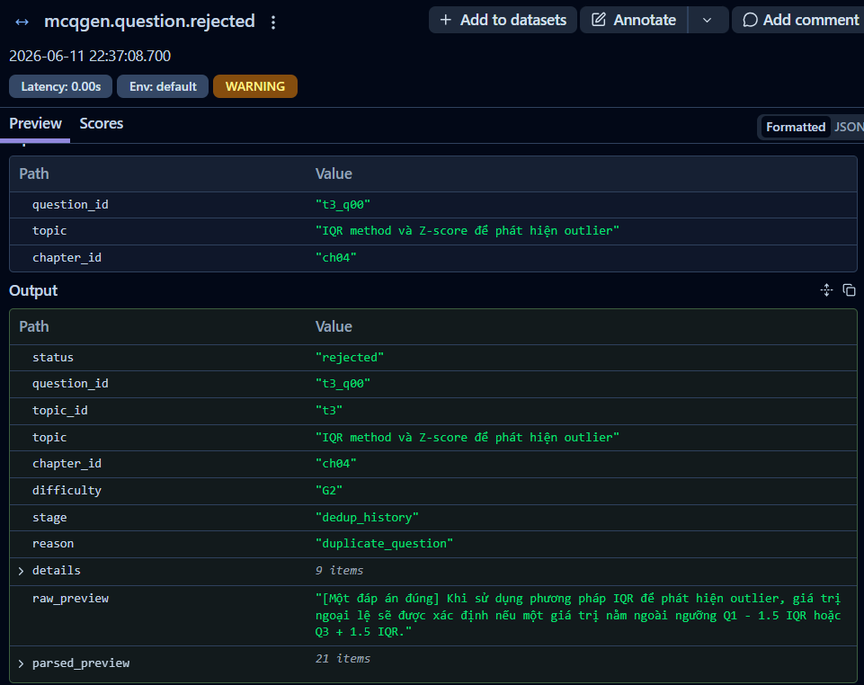
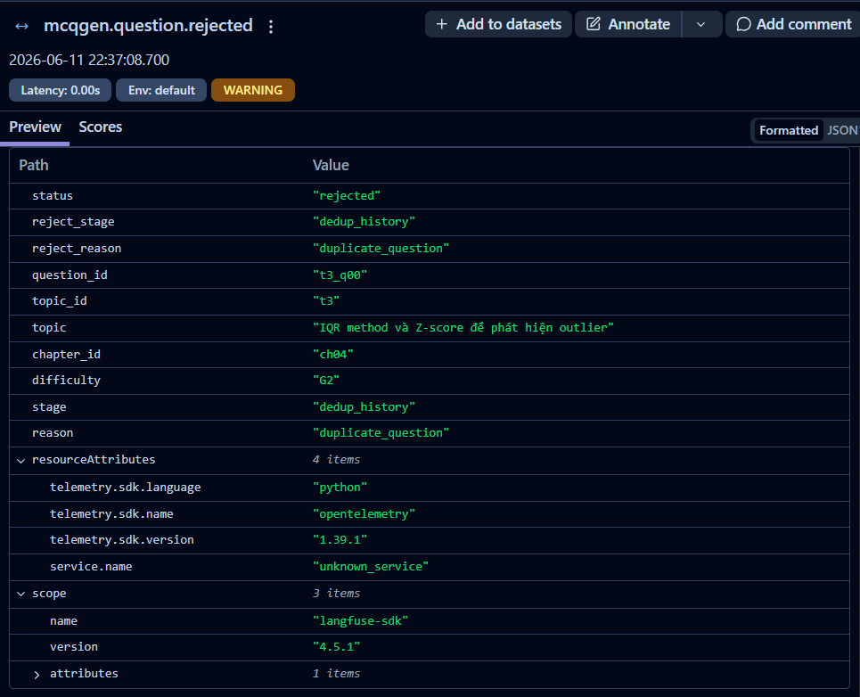
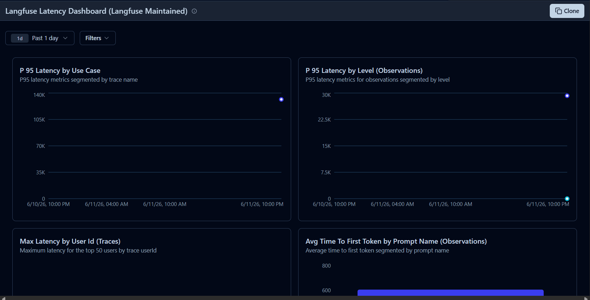
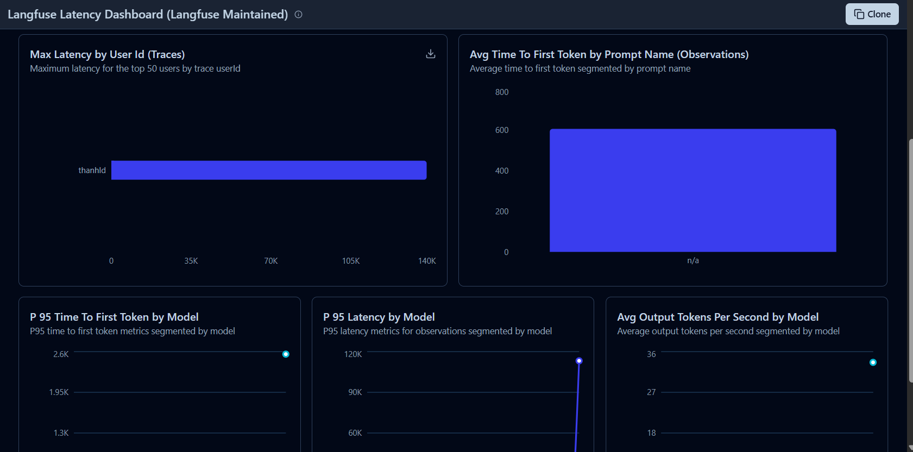
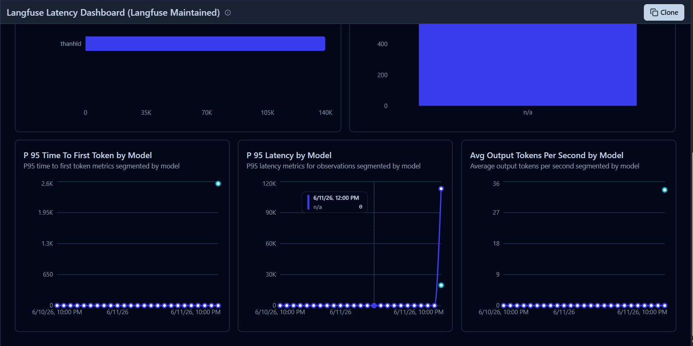

# Báo cáo Monitoring & Evaluation với Langfuse

## 1. Mục tiêu

Báo cáo này trình bày cách nhóm dùng **Langfuse** để quan sát một phiên sinh đề thật của hệ thống MCQGen. Mục tiêu không chỉ là biết request thành công hay thất bại, mà còn thấy được toàn bộ pipeline sinh câu hỏi: API nhận request, Celery chạy job, RAG retrieve context, từng stage LLM sinh nội dung, quality gate, accepted/rejected MCQ và các chỉ số latency/token.

Langfuse là kênh monitoring/tracing chính của project. Các stack cũ như Phoenix, Grafana, Prometheus, Streamlit và Flower không còn được dùng trong báo cáo này.

## 2. Trace được ghi nhận

Một ví dụ từ trace đã quan sát, thông tin chính đọc được từ trace:

| Thuộc tính | Giá trị |
| --- | --- |
| Trace name | `mcqgen.generate_exam` |
| Trace ID | `58fcb028e86b6fb727794a5914cc465b` |
| Thời điểm trace | `2026-06-11 22:35:27.309` |
| Latency tổng | khoảng **2m18s** |
| User ID | `thanhld` |
| Session ID | `thanhld:exam:c231e691-c679-43a6-968d-5261fee2bc1a` |
| Output name | `de_cua_thanh_so_1_c231e691` |
| Prompt tokens | `39,340` |
| Completion tokens | `12,033` |
| Tổng tokens | `51,373` |
| Accepted questions | `2` |
| Failed questions | `2` |
| Acceptance rate | `0.50` |
| Traffic tag | `traffic:single-user` |
| Concurrent user bucket | `ccu:1` |
| Environment tag | `env:prod` |
| Run tag | `run:manual` |

Kết quả này cho thấy hệ thống đã trace đúng user, session, traffic mode, output name, token usage và quality score cho một request sinh đề thực tế.



**Giải thích ảnh:** ảnh session overview cho thấy trace `mcqgen.generate_exam` là trace gốc của phiên sinh đề. Bên phải hiển thị user/session/tags/input/output; bên trái là timeline các observation con. Phần output ghi rõ `accepted = 2`, `failed = 2`, `acceptance_rate = 0.5` và `failure_stage_counts` gồm `opening_check = 1`, `dedup_history = 1`.

## 3. Cấu trúc pipeline được trace

Langfuse ghi lại pipeline theo dạng cây:

```text
mcqgen.generate_exam
└── celery.run_mcq_pipeline
    └── pipeline.run_pipeline_with_topics
        ├── rag.retrieve
        ├── llm.P1_gen_stem_key
        ├── llm.P4_option_candidates
        ├── llm.P5_cot_evaluate
        ├── llm.P6_remove_bad
        ├── llm.P7_select_final
        ├── llm.P8_assemble
        ├── guardrail.opening_check
        ├── llm.P9_explanation
        ├── llm.OPENING_REPAIR
        ├── mcqgen.question.accepted
        └── mcqgen.question.rejected
```



**Giải thích ảnh:** timeline cho thấy request được Celery xử lý trong khoảng 2m18s, phần pipeline chính khoảng 1m42s. Có nhiều observation `rag.retrieve`, mỗi lượt retrieval mất khoảng vài giây. Các observation `llm.P1_gen_stem_key` hiển thị latency từng prompt stage, số input/output tokens và `time_to_first_token`. Ví dụ một stage P1 mất khoảng 13.33s, output 304 tokens và time-to-first-token khoảng 2.62s.



**Giải thích ảnh:** graph view cho thấy luồng xử lý theo thứ tự stage. Các node có dạng `(4/4)` nghĩa là stage đó được gọi cho 4 câu/topic. Sau `guardrail.opening_check (4/4)`, chỉ có `llm.P9_explanation (3/3)`, cho thấy một câu không đi tiếp tới explanation do bị loại hoặc cần xử lý khác trước đó. Cuối pipeline có `mcqgen.question.accepted (2/2)` và `mcqgen.question.rejected (2/2)`, khớp với acceptance rate 50%.

## 4. Phân tích rejected questions

Trace hiện tại có 2 câu bị loại. Ảnh chụp chi tiết cho thấy một lỗi cụ thể:

| Question ID | Topic | Chapter | Difficulty | Reject stage | Reject reason |
| --- | --- | --- | --- | --- | --- |
| `t3_q00` | `IQR method và Z-score để phát hiện outlier` | `ch04` | `G2` | `dedup_history` | `duplicate_question` |



**Giải thích ảnh:** observation `mcqgen.question.rejected` ghi input là topic/chapter của câu hỏi và output là status `rejected`. Câu `t3_q00` bị loại tại stage `dedup_history`, reason `duplicate_question`. Điều này nghĩa là câu hỏi được sinh ra có nội dung quá giống câu đã từng xuất hiện trong lịch sử của user hoặc trong bộ câu đã lưu, nên hệ thống chủ động loại để tránh trùng lặp đề.



**Giải thích ảnh:** ảnh metadata xác nhận lại `reject_stage = dedup_history`, `reject_reason = duplicate_question`, đồng thời cho thấy trace được ghi qua OpenTelemetry/Langfuse SDK. Đây là bằng chứng rằng cơ chế dedup lịch sử đã được đưa vào observability, không chỉ chạy ngầm trong backend.

Từ trace này có thể kết luận:

- Một phần failure không phải do model không sinh được câu hỏi, mà do quality gate/dedup chủ động loại câu trùng.
- Với câu bị reject do `duplicate_question`, hướng xử lý không phải chỉ tăng số lần retry, mà cần cải thiện prompt đa dạng hóa stem/distractor hoặc mở rộng retrieval context để câu mới khác lịch sử hơn.
- Trace cũng ghi nhận `opening_check = 1`, nghĩa là còn một câu bị ảnh hưởng bởi kiểm tra opening style. Cần mở observation tương ứng trong Langfuse để xem câu đó bị loại vì mở đầu lặp, không tự nhiên, hay cần repair.

## 5. Dashboard latency và token metrics

Langfuse dashboard giúp đọc nhanh các chỉ số vận hành của phiên sinh đề.



**Giải thích ảnh:** dashboard có các biểu đồ P95 latency theo use case và P95 latency theo observation level. Với trace này, điểm dữ liệu chính nằm gần thời điểm 2026-06-11 buổi tối, tương ứng phiên `mcqgen.generate_exam`. Vì đây là một phiên đơn lẻ trong khoảng lọc 1 ngày, P95 gần với latency thực tế của trace.



**Giải thích ảnh:** biểu đồ `Max Latency by User Id` cho thấy user `thanhld` là user tạo trace có latency lớn nhất trong cửa sổ quan sát. Biểu đồ `Avg Time To First Token by Prompt Name` cho thấy time-to-first-token trung bình khoảng 600ms ở nhóm prompt `n/a`. Biểu đồ `P95 Time To First Token by Model` có điểm khoảng 2.6K ms, nghĩa là tail latency trước token đầu tiên có thể lên khoảng 2.6 giây ở một số LLM observation.



**Giải thích ảnh:** biểu đồ `P95 Latency by Model` có điểm cao nhất khoảng hơn 110K ms ở model/prompt group `n/a`. Điều này phản ánh có observation LLM/pipeline kéo dài đáng kể trong phiên sinh đề. Biểu đồ `Avg Output Tokens Per Second by Model` đạt khoảng 35 tokens/s, cho thấy vLLM local có throughput khả dụng trong phiên trace này.

Các chỉ số có thể ghi nhận từ dashboard:

| Metric | Giá trị quan sát xấp xỉ | Ý nghĩa |
| --- | --- | --- |
| Trace latency tổng | ~2m18s | Thời gian từ lúc request sinh đề bắt đầu đến khi có kết quả |
| Max latency by user | `thanhld`, ~140K ms | User `thanhld` là user có trace dài nhất trong cửa sổ lọc |
| Avg TTFT by prompt name | ~600ms | Trung bình thời gian đến token đầu tiên của observation |
| P95 TTFT by model | ~2.6K ms | Tail latency trước token đầu tiên |
| P95 latency by model | ~110K-120K ms | Có stage/model observation dài trong pipeline |
| Avg output tokens/s | ~35 tokens/s | Tốc độ sinh token trung bình của model local |

Lưu ý: các số trong dashboard là số đọc từ screenshot, nên nên dùng từ “khoảng/xấp xỉ” khi trình bày. Nếu cần số chính xác, xuất CSV hoặc query trực tiếp từ Langfuse.

## 6. Đánh giá phiên trace

### Điểm đã hoạt động tốt

- Trace có đủ `user_id`, `session_id`, `tags` và `metadata`, giúp truy theo người dùng và phiên sinh đề.
- Pipeline hierarchy rõ: API/Celery/RAG/LLM/guardrail/accepted/rejected đều được ghi nhận.
- Token usage được ghi nhận ở cấp trace: 39,340 prompt tokens và 12,033 completion tokens.
- Quality score cơ bản đã có: accepted, failed, acceptance rate, reject stage.
- Dedup lịch sử được trace rõ qua `dedup_history` và `duplicate_question`.
- Concurrency tagging hoạt động: trace được gắn `traffic:single-user`, `ccu:1`.

### Điểm cần cải thiện

- Một số dashboard hiển thị prompt/model là `n/a`. Nên truyền rõ `prompt_name`, `model`, `stage` vào từng LLM observation để dashboard group đẹp hơn.
- Cần mở thêm observation của lỗi `opening_check` để biết chính xác câu bị reject do opening style nào.
- Với acceptance rate 50%, cần đọc thêm output của các stage trước reject để xác định model sinh câu trùng vì retrieval context quá hẹp, prompt chưa đủ đa dạng, hay lịch sử user đã có nhiều câu cùng topic.
- Nếu muốn so sánh single-user và multi-user, cần tạo thêm nhiều trace với tag `traffic:multi-user` và các bucket `ccu:2-5`, `ccu:6-10`.

## 7. Quy trình đọc trace cho các lần sau

1. Vào **Tracing / Traces**, lọc `usecase:generate_exam`.
2. Mở trace `mcqgen.generate_exam` của phiên cần phân tích.
3. Xem phần đầu trace: user, session, tags, latency, token usage.
4. Mở output tổng: `accepted`, `failed`, `acceptance_rate`, `failure_stage_counts`.
5. Xem graph/timeline để biết stage nào chạy đủ, stage nào thiếu hoặc lâu bất thường.
6. Với câu bị reject, mở `mcqgen.question.rejected` và đọc `reject_stage`, `reject_reason`, `raw_preview`, `parsed_preview`.
7. Quay lại các observation trước đó như `rag.retrieve`, `llm.P1_*`, `llm.P4_*`, `guardrail.opening_check` để tìm nguyên nhân sâu hơn.
8. Ghi lại stage lỗi nhiều nhất để ưu tiên sửa prompt/retrieval/dedup logic.

## 8. Kết luận

Phiên trace này chứng minh Langfuse đã được tích hợp đúng vào pipeline MCQGen. Hệ thống không chỉ ghi nhận request tổng, mà còn ghi được từng stage sinh câu hỏi, token usage, latency, user/session, traffic tag và lý do reject. Kết quả cụ thể của phiên này là 4 câu được yêu cầu, 2 câu accepted, 2 câu rejected, acceptance rate 50%. Một câu bị reject do `duplicate_question` ở stage `dedup_history`, cho thấy cơ chế chống trùng câu hỏi đang hoạt động và có thể truy vết được bằng Langfuse.
