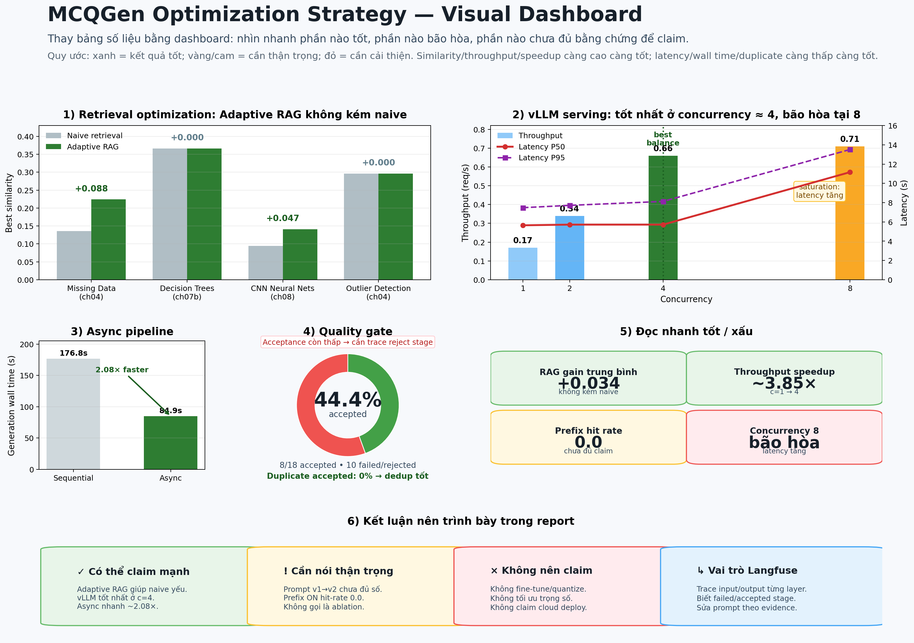
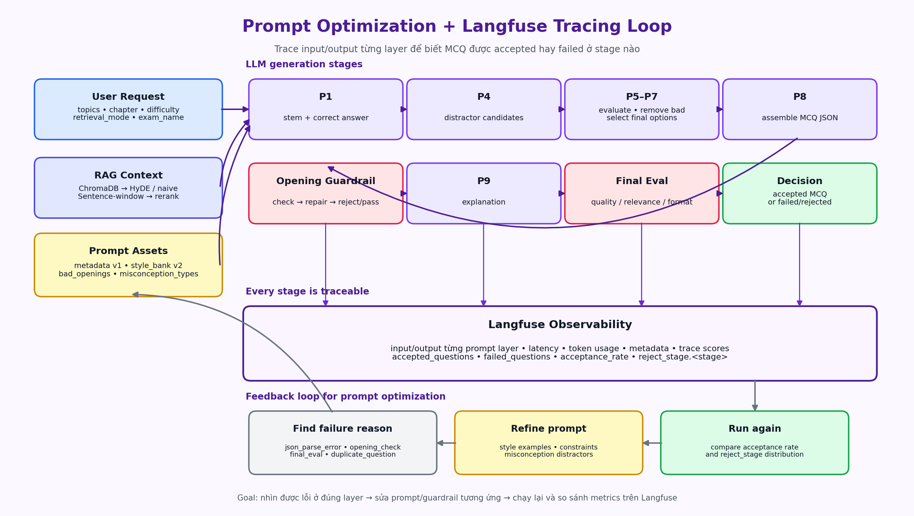

# Báo cáo Tối ưu hóa trực quan (Optimization Strategy) — MCQGen

Ngày cập nhật: 2026-06-11  
Phạm vi: báo cáo này thay cho phần **Optimization Strategy** đặt trực tiếp trong README chính. README chỉ nên giữ link tới báo cáo này để tránh quá dài và tránh lặp bảng số liệu.

## 1. Quan điểm tối ưu hóa của hệ thống

MCQGen **không train, không fine-tune và không quantize** mô hình ngôn ngữ. Hệ thống dùng **Qwen2.5-7B-Instruct** được phục vụ cục bộ qua **vLLM** với OpenAI-compatible API, served-name `mcqgen`.

Vì vậy, phần “optimization” trong project này được hiểu đúng theo bối cảnh **LLMOps**:

- **Retrieval optimization**: adaptive RAG, HyDE khi cần, cross-encoder rerank.
- **Prompt optimization**: prompt versioning, style bank, opening guardrail, misconception-guided distractor.
- **Serving/runtime optimization**: vLLM batching, PagedAttention, async pipeline, dynamic concurrency.
- **System optimization**: Redis cache, dedup câu hỏi, Celery queue và Langfuse monitoring.

## 2. Dashboard trực quan kết quả tối ưu

Thay vì để nhiều bảng rời rạc, hình dưới gom các kết quả chính vào một dashboard. Người đọc có thể nhìn nhanh: phần nào tốt, phần nào bão hòa, phần nào chưa đủ bằng chứng để claim mạnh.



Cách đọc hình:

- **Màu xanh**: kết quả tốt hoặc có thể claim tương đối chắc.
- **Màu vàng/cam**: điểm cần thận trọng, thường là bão hòa hoặc chưa đo đủ ablation.
- **Màu đỏ**: không nên diễn giải quá mức hoặc cần tối ưu tiếp.
- Với **similarity/throughput/speedup**, giá trị cao hơn thường tốt hơn.
- Với **latency/wall time/duplicate**, giá trị thấp hơn thường tốt hơn.

## 3. Giải thích từng nhóm tối ưu

### 3.1. Retrieval optimization — Adaptive RAG

Pipeline trong `src/mcqgen/advanced_retrieval.py` không dùng một chiến lược retrieve cố định. Hệ thống trước hết chạy naive retrieval để lấy điểm similarity ban đầu. Nếu naive đã đủ tốt, pipeline giữ `naive+rerank` để tiết kiệm chi phí. Nếu naive yếu, pipeline kích hoạt **HyDE** để sinh câu hỏi giả định, trộn embedding theo tỉ lệ `0.6*topic + 0.4*hypo`, sau đó retrieve lại và rerank bằng cross-encoder.

Kết quả trong dashboard cho thấy adaptive retrieval **không làm kém hơn naive** trên các topic đã thử. Với các topic naive yếu như *Missing Data* và *CNN Neural Networks*, HyDE giúp cải thiện similarity rõ ràng. Với các topic naive đã ổn như *Decision Trees* và *Outlier Detection*, hệ thống không tốn thêm lượt HyDE mà giữ chiến lược tiết kiệm hơn.

**Như thế nào là tốt?**  
Tốt là khi adaptive retrieval tăng hoặc ít nhất giữ nguyên similarity so với naive, đồng thời chỉ bật HyDE khi thật sự cần. Điều này chứng minh pipeline có tính “adaptive”, không phải lúc nào cũng gọi thêm LLM.

**Như thế nào là xấu?**  
Xấu là khi adaptive làm similarity giảm, hoặc HyDE luôn bị gọi dù naive retrieval đã đủ tốt. Trường hợp đó sẽ vừa làm chậm hệ thống vừa không cải thiện chất lượng context.

### 3.2. Prompt optimization — tối ưu dựa trên Langfuse trace

Prompt optimization của nhóm không chỉ là sửa prompt thủ công. Nhóm dùng **Langfuse** để quan sát input/output của từng layer trong pipeline sinh MCQ. Mỗi câu hỏi đi qua nhiều stage như RAG context, sinh stem, sinh distractor, evaluate, filter, assemble JSON, opening check, explanation và final evaluation.



Ý nghĩa của Langfuse trong tối ưu prompt:

- Trace được **input/output của từng prompt layer**, nên biết prompt nào tạo ra nội dung kém.
- Biết câu MCQ bị **failed/rejected** ở stage nào: JSON parse, distractor, opening style, final evaluation hoặc dedup.
- Biết câu MCQ được **accepted** nhờ tổ hợp RAG context, prompt version và evaluator nào.
- Có thể đọc lại trace để sửa đúng prompt đang gây lỗi, thay vì chỉnh toàn bộ pipeline theo cảm tính.

Cụ thể, repo có các thành phần phục vụ prompt optimization:

- `prompts/v1/metadata.json`: prompt P1–P8 gốc.
- `prompts/v2/style_bank.json`: few-shot style từ đề CS116 thật.
- `prompts/v2/bad_openings.json`: danh sách opening không nên dùng.
- `prompts/v2/opening_families.json`: nhóm hóa kiểu mở đầu để tránh lặp style.
- `prompts/v2/misconception_types.json`: định hướng distractor theo lỗi sai thường gặp.

**Như thế nào là tốt?**  
Tốt là khi acceptance rate tăng, reject ở `opening_check` và `final_eval` giảm, các distractor hợp lý hơn, và câu hỏi accepted không bị trùng theo lịch sử.

**Như thế nào là xấu?**  
Xấu là khi nhiều câu bị reject ở cùng một stage. Ví dụ nhiều lỗi `opening_check` nghĩa là prompt sinh stem/opening chưa ổn; nhiều lỗi `final_eval` nghĩa là câu hỏi cuối chưa đủ chất lượng hoặc distractor chưa thuyết phục.

Lưu ý trung thực: prompt v1 → v2 đã có thiết kế và code hỗ trợ, nhưng chưa có đủ số đo đối chứng để claim v2 tốt hơn v1 bằng phần trăm cụ thể. Vì vậy báo cáo chỉ nên nói đây là **hướng tối ưu có trace và có cơ chế đo**, không nên claim quá mức nếu chưa generate thêm run mới.

### 3.3. Serving/runtime optimization — vLLM batching và điểm bão hòa

Tầng serving dùng vLLM để phục vụ Qwen2.5-7B-Instruct local. Các script benchmark trong thư mục `vllm/` đo throughput và latency ở nhiều mức concurrency.

Dashboard cho thấy throughput tăng mạnh từ concurrency 1 đến 4, trong khi latency P50 gần như giữ quanh mức ổn định. Đây là dấu hiệu tốt của continuous batching: nhiều request được xử lý song song mà không làm độ trễ trung vị tăng đáng kể.

Tuy nhiên, tại concurrency 8, throughput chỉ tăng rất nhẹ nhưng latency P50/P95 tăng mạnh. Đây là dấu hiệu **bão hòa** do cấu hình server hiện tại đặt `--max-num-seqs 4`; khi gửi 8 request đồng thời, một phần request phải chờ slot.

**Như thế nào là tốt?**  
Tốt là vùng concurrency 1 → 4: throughput tăng rõ, latency chưa tăng nhiều. Đây là điểm cân bằng nên trình bày trong báo cáo.

**Như thế nào là xấu?**  
Xấu hoặc cần thận trọng là vùng concurrency 8: throughput gần như chững lại nhưng latency tăng mạnh. Không nên kết luận “cứ tăng concurrency là tốt”; cần tìm điểm bão hòa theo GPU và `max_num_seqs`.

### 3.4. Async pipeline vs sequential

`pipeline_mcq.py` sinh nhiều câu MCQ theo kiểu bất đồng bộ để vLLM có cơ hội batch/schedule nhiều LLM call song song. Kết quả benchmark nhỏ cho thấy async pipeline giảm generation wall time từ khoảng 176.76 giây xuống 84.91 giây, tương đương nhanh hơn khoảng 2.08× ở phần generation-only.

**Như thế nào là tốt?**  
Tốt là tổng thời gian sinh đề giảm trong khi số câu accepted không giảm. Điều này chứng minh tối ưu nằm ở orchestration/runtime, không cần thay model.

**Như thế nào là xấu?**  
Xấu là khi tăng async/concurrency làm nhiều request fail, tăng timeout hoặc làm latency tail quá cao. Khi đó cần giới hạn concurrency bằng semaphore, global slot guard và thông tin load từ Redis.

### 3.5. Quality gate, accepted/failed và dedup

Run evaluation hiện tại yêu cầu 18 câu, accepted 8 câu, failed/rejected 10 câu, acceptance rate đạt 44.4%. Trong 8 câu accepted, không phát hiện câu trùng theo stem, tức duplicate rate của accepted là 0%.

**Như thế nào là tốt?**  
Duplicate 0% là tín hiệu tốt cho cơ chế dedup theo lịch sử. Accepted MCQ không bị lặp giúp đề thi đa dạng hơn.

**Như thế nào là cần cải thiện?**  
Acceptance rate 44.4% cho thấy pipeline còn nhiều câu bị loại. Đây không nhất thiết là xấu nếu evaluator nghiêm ngặt, nhưng nhóm cần lưu reject reason đầy đủ hơn để biết lỗi nằm ở RAG, prompt, distractor, opening hay final evaluation.

### 3.6. Prefix caching — chưa đủ bằng chứng để claim mạnh

vLLM được bật `--enable-prefix-caching`, nhưng kết quả đo hiện tại mới chạy chế độ ON và prefix hit rate trong lần benchmark này bằng 0.0. Vì vậy, không nên trình bày rằng prefix caching đã được chứng minh hiệu quả bằng ablation.

Cách viết đúng trong báo cáo:

> Hệ thống đã bật prefix caching trong cấu hình vLLM. Tuy nhiên, benchmark hiện tại chưa đủ để kết luận lợi ích của prefix caching vì chưa có so sánh ON/OFF độc lập và hit rate của lần đo này bằng 0.0. Đây là mục cần đo lại nếu muốn claim chính thức.

## 4. Những claim nên dùng và không nên dùng

### Nên claim

- Hệ thống tối ưu theo hướng LLMOps, không fine-tune model.
- Adaptive RAG giúp cải thiện retrieval khi naive retrieval yếu và không làm kém hơn naive trong benchmark nhỏ.
- vLLM batching giúp throughput tăng rõ từ concurrency 1 đến 4.
- Concurrency 4 là điểm cân bằng tốt hơn concurrency 8 trong cấu hình hiện tại vì concurrency 8 bắt đầu bão hòa latency.
- Async pipeline giảm generation wall time khoảng 2.08× trong benchmark nhỏ.
- Langfuse giúp trace input/output từng prompt layer, từ đó biết MCQ bị failed/accepted ở stage nào.
- Redis cache và dedup là các tối ưu hệ thống giúp tránh chạy lại request trùng và giảm câu hỏi lặp.

### Không nên claim

- Không claim đã fine-tune, quantize hoặc optimize trọng số Qwen2.5-7B-Instruct.
- Không claim đã cloud deploy nếu hệ thống chỉ chạy local/server lab.
- Không claim sentence-window đang là kết quả chính nếu collection sentence-window chưa build đầy đủ và còn fallback.
- Không claim prefix caching đã chứng minh hiệu quả nếu chưa có ablation ON/OFF.
- Không claim prompt v2 tốt hơn v1 bằng phần trăm cụ thể nếu chưa generate đủ run đối chứng.

## 5. Cách tái lập số liệu

Các lệnh chính để chạy lại benchmark và sinh số liệu:

```bash
# Chạy từ root repo.
conda activate mcqgen_v2
export VLLM_URL=http://localhost:7681/v1
export VLLM_MODEL=mcqgen

# RAG benchmark
python -m src.mcqgen.advanced_retrieval adaptive | tee data/benchmarks/rag_benchmark.log

# vLLM concurrency sweep
python vllm/exp02_llm_concurrency_sweep.py --num-requests 100 --concurrency-list 1,2,4,8 --label sweep

# Sequential vs async pipeline
python vllm/exp03_pipeline_sequential_vs_async.py --modes sequential,async --concurrency 4 --label pipeline

# Prefix cache benchmark hiện tại mới đo ON, chưa đủ để claim ablation
python vllm/exp05_prefix_cache_ablation.py --concurrency 4 --num-requests 40 --prefix-cache-mode on

# Evaluation report sau khi generate đề
python scripts/eval_report.py --latest
```

## 6. Kết luận ngắn cho người chấm

Điểm chính của optimization trong MCQGen là nhóm không cố “train model”, mà tối ưu toàn bộ vòng đời vận hành LLM: context được retrieve tốt hơn, prompt được trace và sửa theo evidence, serving dùng vLLM để tăng throughput, pipeline async để giảm thời gian, còn Langfuse/Redis/Celery giúp quan sát và kiểm soát lỗi ở từng stage. Dashboard trực quan cho thấy các kết quả đã đo được, đồng thời cũng chỉ rõ những mục cần nói thận trọng để báo cáo không claim quá mức.
